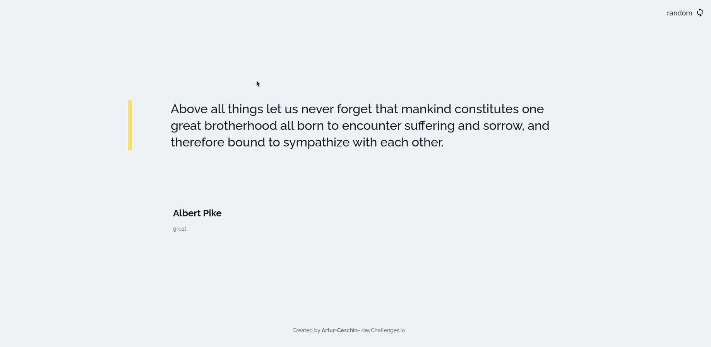

<!-- Please update value in the {}  -->

<h1 align="center">Random Quote Generator</h1>

<div align="center">
   Solution for a challenge from  <a href="http://devchallenges.io" target="_blank">Devchallenges.io</a>.
</div>

<div align="center">
  <h3>
    <a href="https://random-quote-generator-xi.vercel.app/">
      Demo
    </a>
    <span> | </span>
    <a href="https://github.com/Artur-Ceschin/random-quote-generator">
      Solution
    </a>
    <span> | </span>
    <a href="https://devchallenges.io/challenges/8Y3J4ucAMQpSnYTwwWW8">
      Challenge
    </a>
  </h3>
</div>

<!-- OVERVIEW -->

## Overview



### Built with 💻

- [Next](https://vercel.com/home?utm_source=next-site&utm_medium=banner&utm_campaign=next-website)
- [Chackra UI](https://chakra-ui.com/)

## Features

<!-- List the features of your application or follow the template. Don't share the figma file here :) -->

This application/site was created as a submission to a [DevChallenges](https://devchallenges.io/challenges) challenge. The [challenge](https://devchallenges.io/challenges/8Y3J4ucAMQpSnYTwwWW8) was to build an application to complete the given user stories.

## How To Use

<!-- For example: -->

To clone and run this application, you'll need [Git](https://git-scm.com) and [Node.js](https://nodejs.org/en/download/) (which comes with [npm](http://npmjs.com)) installed on your computer. You can also use [yarn](https://yarnpkg.com/), if you have From your command line:

```bash
# Clone this repository
$ git clone https://github.com/Artur-Ceschin/random-quote-generator.git

# Access
$ cd random-quote-generator

# Install dependencies
$ npm install or yarn

# Run the app
$ npm dev or yarn dev
```

### Author

---

Made with ❤️ by Artur Ceschin 👋🏻 Please fell free to contact me!
<br/>
[](https://www.linkedin.com/in/artur-peres-ceschin-programador/)
[](mailto:artur.ceschin@gmail.com)
